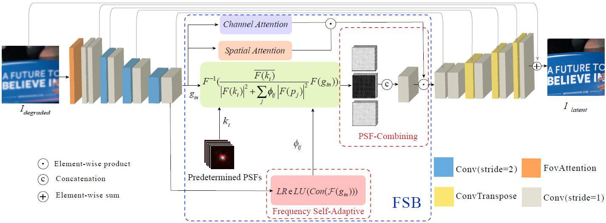
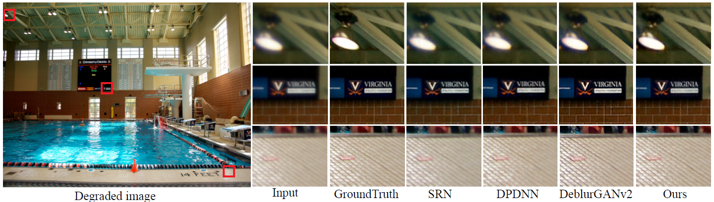
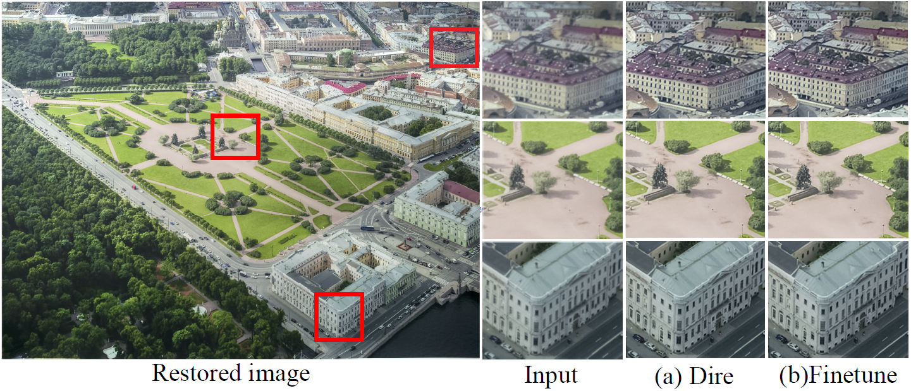
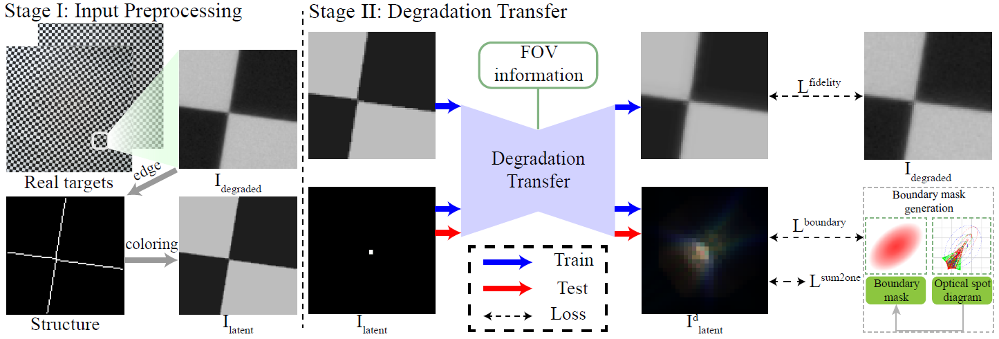

# Non-blind optical degradation correction via frequency self-adaptive and finetune tactics

The official implementation of [Non-blind optical degradation correction via frequency self-adaptive and finetune tactics](https://opg.optica.org/oe/abstract.cfm?URI=oe-30-13-23485) (OSA OE 2022)

# Abstract
In mobile photography applications, limited volume constraints the diversity of optical design. In addition to the narrow space, the deviations introduced in mass production cause random bias to the real camera. In consequence, these factors introduce spatially varying aberration and stochastic degradation into the physical formation of an image. Many existing methods obtain excellent performance on one specific device but are not able to quickly adapt to mass production. To address this issue, we propose a **frequency self-adaptive model** to restore realistic features of the latent image. The restoration is mainly performed in the Fourier domain and two attention mechanisms are introduced to match the feature between Fourier and spatial domain. Our method applies a lightweight network, without requiring modification when the fields of view (FoV) changes. Considering the manufacturing deviations of a specific camera, **we first pre-train a simulation-based model, then finetune it with additional manufacturing error, which greatly decreases the time and computational overhead consumption in implementation.** Extensive results verify the promising applications of our technique for being integrated with the existing post-processing systems.



# Visualization Comparisons


<center>Spatial-variant PSFs aberration correction results</center>


<center>Directly training on synthetic compared with finetune results, evaluating on the real captured photographs</center>


# Requirements
We run this repo in the conda environment of PyTorch 2.0.1+cu118, Python3.9.6, CUDA12.2. You can setup the package as follows:

```bash
pip install -r requirements.txt
```

# Procedures
- Based on the simulation, generate the synthetic datasets (only optical aberrations are considered here). We provide the whole-plane PSFs of [Huawei Honor 20 Pro](https://drive.google.com/file/d/1IBarXdqayMuvm0cDWstPhAeloeBwKUPk/view?usp=drive_link) for you. Please *unrar* this file and convolve the image patch-by-patch to obtain the basic training datasets (the detailed convolution opeartion is the same as this [Imaging Simulation Repo](https://github.com/TanGeeGo/ImagingSimulation)).
- Training the FSANet with the synthetic datasets.
- Pre-Calibrate the camera for real measurement PSFs, you can follow the [detialed instructions](https://github.com/TanGeeGo/DegradationTransfer) here.



- Generate the finetuning dataset for a specific camera.
- Finetuning the pre-trained FSANet with the finetuning dataset.

## Training
```bash
python main_train_sample.py --opt options/option_official_implementation_fsanet.json
```
Note that the paths of image-pairs and kernels in `option_official_implementation_fsanet.json` need to be modified between the training and finetuning. 
## Testing
```bash
python main_test_sample.py --opt options/option_official_implementation_fsanet.json
```

# Download Resources

**Basic PSFs for generating synthetic datasets**:

https://drive.google.com/file/d/1IBarXdqayMuvm0cDWstPhAeloeBwKUPk/view?usp=drive_link

**A sketch of the Finetuning datasets and Pre-calibrated PSFs of one Huawei Honor 20 Pro (toy dataset)**

https://drive.google.com/file/d/12JolqKjlaodiWSPwSOekYxercOwvNXTZ/view?usp=drive_link

# Citation

If you find the code helpful in your research or work, please cite the following papers
```
@article{Lin_2022_OE,
  author = {Ting Lin and ShiQi Chen and Huajun Feng and Zhihai Xu and Qi Li and Yueting Chen},
  journal = {Opt. Express},
  keywords = {All optical devices; Blind deconvolution; Image processing; Image quality; Optical design; Ray tracing},
  number = {13},
  pages = {23485--23498},
  publisher = {Optica Publishing Group},
  title = {Non-blind optical degradation correction via frequency self-adaptive and finetune tactics},
  volume = {30},
  month = {Jun},
  year = {2022},
  url = {https://opg.optica.org/oe/abstract.cfm?URI=oe-30-13-23485},
  doi = {10.1364/OE.458530},
  abstract = {In mobile photography applications, limited volume constraints the diversity of optical design. In addition to the narrow space, the deviations introduced in mass production cause random bias to the real camera. In consequence, these factors introduce spatially varying aberration and stochastic degradation into the physical formation of an image. Many existing methods obtain excellent performance on one specific device but are not able to quickly adapt to mass production. To address this issue, we propose a frequency self-adaptive model to restore realistic features of the latent image. The restoration is mainly performed in the Fourier domain and two attention mechanisms are introduced to match the feature between Fourier and spatial domain. Our method applies a lightweight network, without requiring modification when the fields of view (FoV) changes. Considering the manufacturing deviations of a specific camera, we first pre-train a simulation-based model, then finetune it with additional manufacturing error, which greatly decreases the time and computational overhead consumption in implementation. Extensive results verify the promising applications of our technique for being integrated with the existing post-processing systems.},
}
```